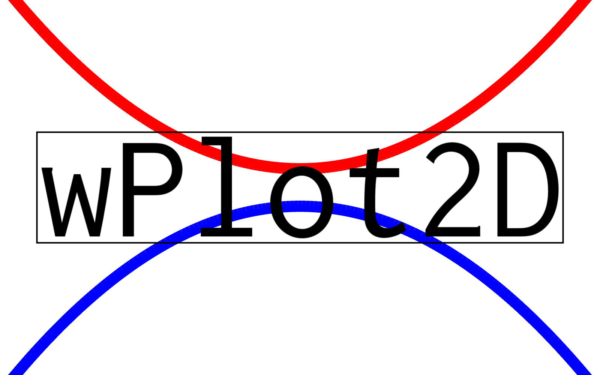

  

# Changelog: wPlot2D

 &nbsp;

All notable changes to this project will be documented in this file.  

## [0.0.0] - octobre 02, 2025

### Added
- Initial project setup  
- Git repository initialized  
- Generated \'.gitignore\', \'README.md\' and \'CHANGELOG.md\'
