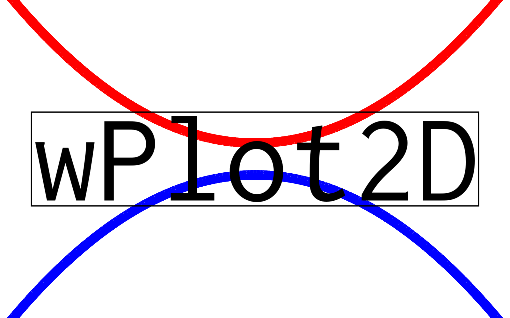

  

 &nbsp;

# wPlot2D

<strong>wPlot2D</strong> is a lightweight C++ plotting library designed to create clean and customizable 2D visualizations.
It provides essential features such as axes, labels, titles, legends, and annotations, while allowing users to
export high-quality graphics for reports, teaching, or research. The library is built with a modular design,
making it easy to integrate into existing C++ projects. Its focus is on clarity, precision, and reproducibility,
providing an accessible tool for academic and scientific work.

## Author

Created by [**Wilfried Koch**](https://weconomikus.github.io/wilfried-koch-page/) on 25-10-02  
Last updated on 2025-10-04, 13:49:27  

## Documentation

- Download the executable on [Itch.io](https://weconomikus.itch.io/wPlot2D)
- Webpage and Doxygen documentation ([html](https://weconomikus.github.io/wilfried-koch-page/wPlot2DPage/wPlot2D))
- Doxygen (pdf): `./project/Resources/Doc/doxygen_wPlot2D_v0.1.0.pdf`
- Main documentation (pdf): `TBD`

## License

<strong>Copyright @ 2025 Wilfried Koch. All rights reserved.</strong>  

This software is proprietary and is **NOT open source**.

License Summary:  
- You are allowed to use the precompiled binaries and libraries of this software
for personal, academic, or research purposes.
- Redistribution of the binaries is permitted only if they remain unmodified
and include this license and copyright notice.
- The source code is provided for reference only. You are NOT allowed to copy,
modify, fork, or distribute the source code, in whole or in part, without
explicit written permission from the author.
- Access to the source code does not grant any license or rights to use,
copy, modify, or distribute it, except as expressly stated herein.

Restrictions:  
- Commercial use of the software (binaries or source) requires explicit written
permission from the author.
- Any attempt to relicense, sublicense, or sell this software, in whole or in
part, is strictly prohibited.

Disclaimer: This software is provided "as is", without warranty of any kind, express or implied, including but not limited to the
warranties of **merchantability**, **fitness for a particular purpose**, and **noninfringement**. In no event shall the author be liable
for any claim, damages, or other liability, whether in an action of contract, tort, or otherwise, arising from, out of, or in connection 
with the software or the use or other dealings in the software.

For inquiries or permissions, please contact: koch.wilfried@uqam.ca

## External Resources and Credits

### Core Libraries

- **SFML 3.0.0** — [https://www.sfml-dev.org](https://www.sfml-dev.org)  
- **Doxygen 1.14.0** -- [https://doxygen.nl](https://doxygen.nl)  
- **git 2.51.0** -- [https://git-scm.com](https://git-scm.com)  

### Fonts

- **CourierPrimeCode** — SIL Open Font License 1.1 - See: `Resources/Fonts/CourierPrimeCode/SIL Open Font License.txt`  
- **Inconsolata** — SIL Open Font License 1.1 - See: `Resources/Fonts/Inconsolata/SIL Open Font License.txt`

### External Licenses

The licenses for all third-party components are available in the `Licenses/` directory.
